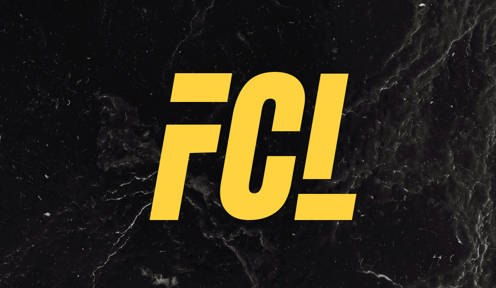
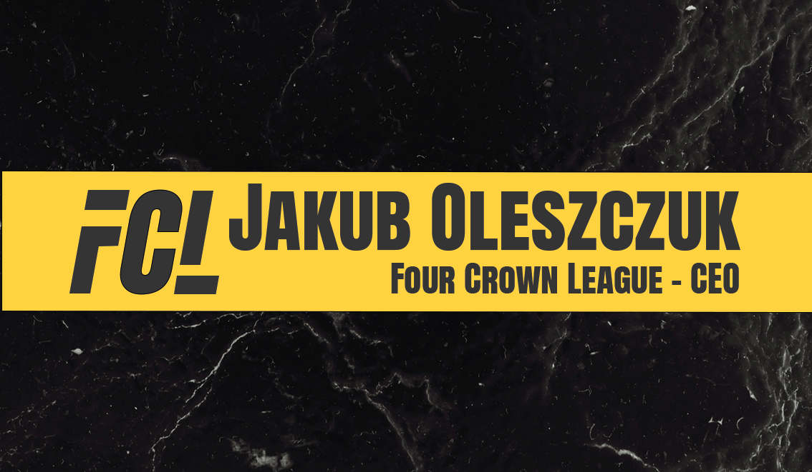
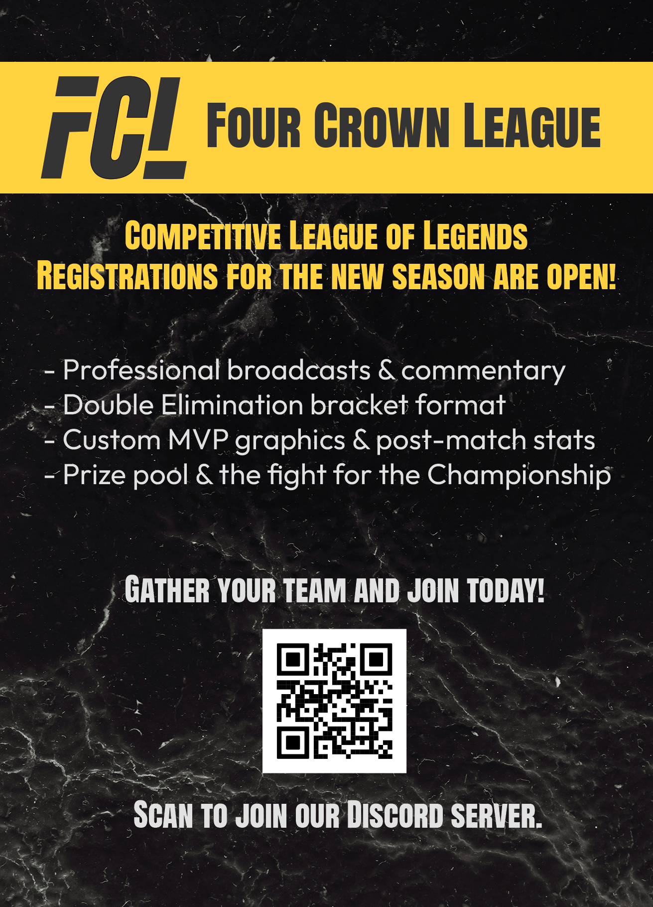

Welcome back! Sorry for the long break, but I have been busy working on the FCL website but I also got several other tasks to do, such as learning Photoshop and improving my design skills because I've become a new graphic designer for the FCL. I designed several of the example graphics for the FCL website, such as the leafles, banners, business cards, and more. I also worked on the "redesign" of the FCL website, since it was my idea to do it in Photoshop for a grade at University subject, I had to do it in Photoshop.
I also have been busy with school, since I have to do several projects and assignments, but I will try to post more often now that I have more free time.

Those are some of the graphics I designed for the FCL, mostly done in Photoshop, for a grade at University, but I also wanted to do it for the FCL, since I thought it would be a good idea to have some graphics for the website and for the FCL in general. I hope you like them! I will try to post more often now that I have more free time, and I will also try to post more about my design process and the tools I use, such as Photoshop, Illustrator, and InDesign. I will also try to post more about my school projects and assignments, since I think it would be interesting to share my work and my progress with you all. Thank you for reading, and I hope you have a great day!
